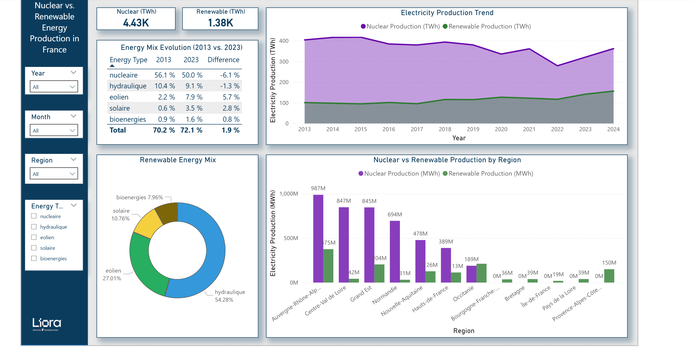
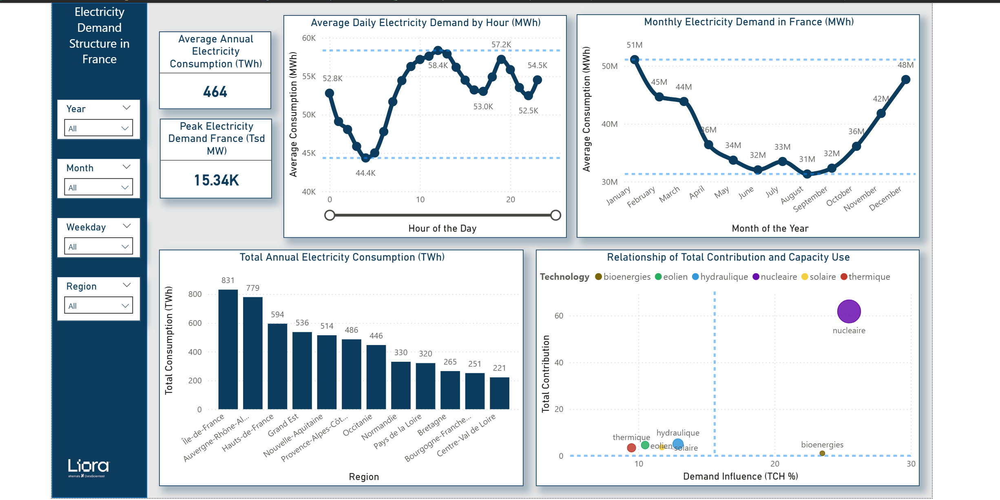
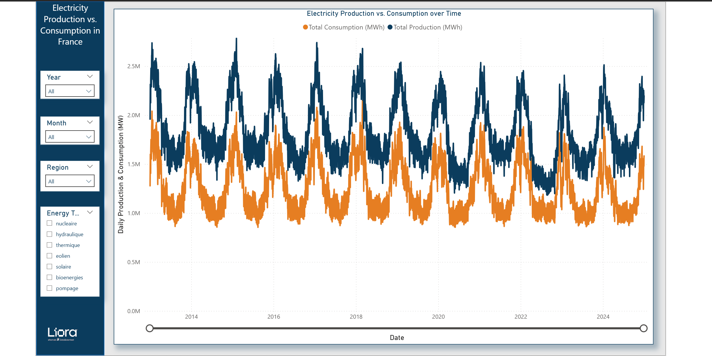

# France Electricity Production & Consumption — A 12-Year Analysis (2013–2024)

**An end-to-end analytics project on 1.2M+ records of French electricity production and demand, delivering a 5-page Power BI report on the nuclear-to-renewable transition, regional generation asymmetry, and hourly demand structure.**

---

## The Question

France runs the most nuclear-dependent grid in the world. Three things are worth measuring precisely rather than assuming:

1. **Is the energy mix actually shifting?** By how much, and toward what?
2. **Where is power generated vs. where is it consumed?** — and how far apart are they?
3. **What does demand actually look like** across the hour, the week, and the year?

---

## Headline Findings

### 1. The mix is shifting — slowly, and toward wind

| Energy Type | 2013 | 2023 | Δ |
|---|---:|---:|---:|
| Nuclear | 56.1% | 50.0% | **−6.1 pp** |
| Hydro | 10.4% | 9.1% | −1.3 pp |
| **Wind** | 2.2% | 7.9% | **+5.7 pp** |
| **Solar** | 0.6% | 3.5% | **+2.8 pp** |
| Bioenergy | 0.9% | 1.6% | +0.8 pp |

Nuclear lost 6.1 percentage points in a decade. **Wind absorbed almost all of it.** Solar nearly sextupled its share off a tiny base. Hydro — long the second pillar — is flat to declining.

Over the full period: **Nuclear 4.43K TWh** vs. **Renewable 1.38K TWh** — roughly a 3.2 : 1 ratio.


*Energy mix evolution, production trend, and regional split.*

### 2. Generation is extremely concentrated; consumption is not

**Top nuclear producers** — Auvergne-Rhône-Alpes (987M MWh), Centre-Val de Loire (847M), Grand Est (845M), Normandie (694M).

**Top consumers** — Île-de-France (831 TWh), Auvergne-Rhône-Alpes (779 TWh), Hauts-de-France (594 TWh).

**The asymmetry:** Île-de-France is the largest consumer in France and generates **essentially zero nuclear power**. Centre-Val de Loire generates 847M MWh and consumes the least of any major region (221 TWh). The French grid is therefore not a distribution network — it is a **long-haul transmission problem**.

Within the renewable mix itself: **hydro 54.3%**, **wind 27.0%**, **solar 10.8%**, **bioenergy 8.0%**.

### 3. Demand has a rigid, predictable shape


*Hourly, monthly, and regional demand structure.*

| | |
|---|---|
| Average annual consumption | **464 TWh** |
| Peak demand | **15.34K Tsd MW** |
| Daily trough | **44.4K MWh** (~05:00) |
| Daily peak | **58.4K MWh** (~12:00), second peak 57.2K (~19:00) |
| Seasonal range | **51M MWh (Jan)** → **31M MWh (Aug)** |

Winter demand is **~65% higher** than the August trough — a direct consequence of France's heavy reliance on electric heating. The daily curve shows the classic double peak: midday and evening.

### 4. Production tracks consumption — with permanent headroom


*Daily production and consumption, 2013–2024.*

Production consistently exceeds consumption across the entire 12-year window, with both curves locked in the same seasonal rhythm. France is a structural net exporter — and the surplus is deliberate, not accidental.

---

## Data Model

Star schema built in Power BI:

| Table | Role |
|---|---|
| `FACT_Production` | Electricity generation by region, date, energy type |
| `FACT_Consumption` | Demand by region, date, hour |
| `DIM_Energy` | Energy source dimension (nucléaire, hydraulique, éolien, solaire, bioénergies, thermique, pompage) |
| `DIM_Region` | French administrative regions |
| `Calendar` | Date dimension (year, month, weekday) |
| `HourTable` | Hour-of-day dimension |
| `Measures Table` | Dedicated DAX measures table |

Report pages: **Regional Production · Nuclear vs. Renewable · Consumption · Production vs. Consumption**, each with cross-filtering slicers on Year / Month / Weekday / Region / Energy Type.

---

## Stack

**Power BI Desktop** (DAX, star schema, cross-filtering) · **Python** (pandas, NumPy) for cleaning · 1.2M+ records

---

## Repository Contents

```
.
├── Energy_Final_Report_30.03.2026.pbix   # Final Power BI report (5 pages)
├── docs/img/                             # Dashboard screenshots
└── README.md
```

> Open the `.pbix` in **Power BI Desktop** (free) to explore the model, DAX measures, and interactive slicers.

---

## Author

**Ahmed Maala** — Analytics Engineer (Liora × Sorbonne)
📧 ahmed4maala@gmail.com · [GitHub](https://github.com/ahmed4maala-afk) · [LinkedIn](https://linkedin.com/in/ahmed-maala-b854b0390)
